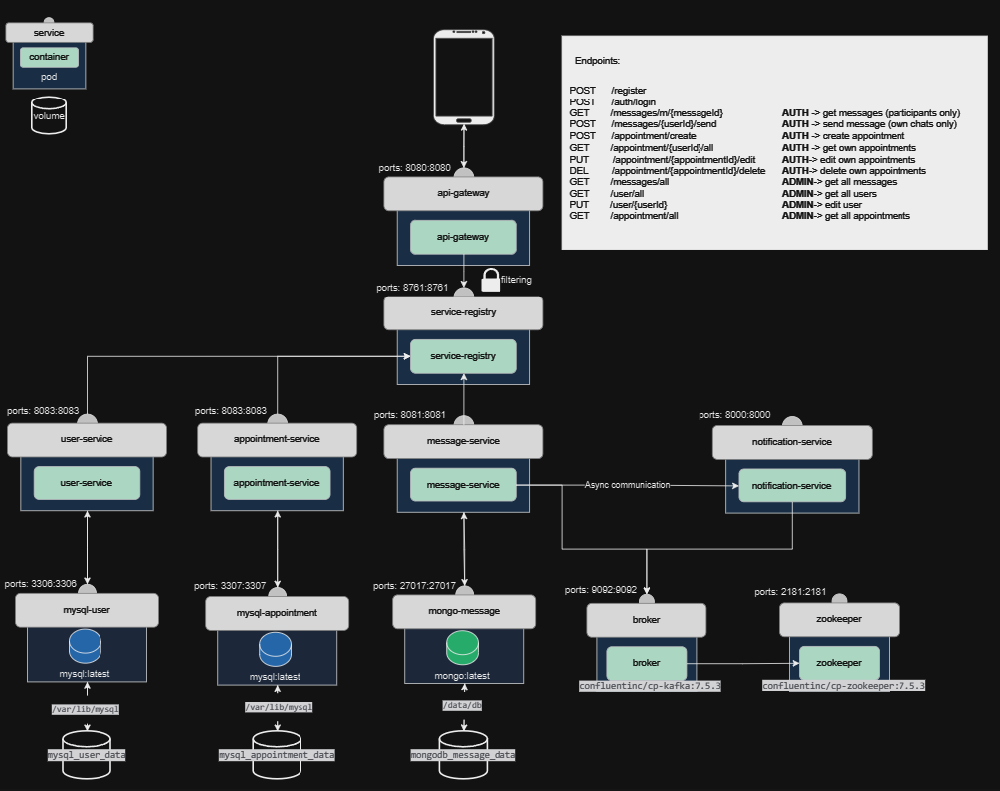

# Enterprise Development Experience project
## Thema Beschrijving
Het gekozen thema van deze microservices-architectuur is een eenvoudig berichten- en afsprakensysteem. 
Het systeem maakt gebruik van verschillende microservices om de functionaliteit te bieden aan de gebruikers.
In mijn Spring Boot-gebaseerde microservice-applicatie heb ik gebruik gemaakt van de krachtige mogelijkheden van Spring Cloud om een schaalbare, veerkrachtige en veilige architectuur te creëren. Elke microservice is ontworpen om één specifieke functionaliteit te bieden, wat resulteert in een modulaire, onderhoudbare en veilige codebase. Door middel van de Service Registry (Eureka) kunnen microservices zich dynamisch registreren en ontdekken, wat een flexibele en gedistribueerde systeemintegratie mogelijk maakt. Ik maak ook gebruik van een API Gateway die inkomende verzoeken routeren naar de juiste microservice, wat een uniforme, gecentraliseerde en beveiligde toegang tot de applicatie biedt. Met de geïntegreerde beveiliging en geavanceerde route filtering van Spring Security kunnen alleen geautoriseerde gebruikers toegang krijgen tot specifieke endpoints, waarbij strikte controlemechanismen zorgen dat de identiteit van de ingelogde gebruiker overeenkomt met de verzender van een bericht. Deze gelaagde beveiliging en toegangscontrole, samen met de asynchrone communicatie via Kafka voor het verwerken van events en notificaties, waarborgen de integriteit, veiligheid en efficiëntie van datastromen binnen de applicatie. Kortom, mijn microservice-applicatie in Spring Boot combineert de flexibiliteit, modulariteit en robuustheid van microservices met geavanceerde beveiligingsmechanismen en systeemintegratie, waardoor een moderne, veilige en toekomstbestendige applicatie-architectuur wordt gerealiseerd die voldoet aan de moderne eisen van privacy en gegevensbescherming.

#### Checklist

- ALGEMENE EISEN & DOCUMENTATIE✅ 
- Maak en gebruik je eigen Auth service i.p.v. GCP OAuth2✅ 
- Maak de interactie met minstens 1 service event-driven✅ 
- Gebruik Kafka i.p.v. ActiveMQ (dit heeft twee pods nodig)✅

## Microservices en Componenten
- **API Gateway**: Fungeert als de toegangspoort voor alle inkomende verzoeken en routeert deze naar de juiste microservice met route-filtering (authenticatie uitbreiding).
- **Appointment Service**: Beheert alle functies met betrekking tot afspraken.
- **Message Service**: Beheert alle berichten gerelateerde functionaliteiten.
- **User Service (Custom Auth)**: Beheert gebruikersgegevens en authenticatie.
- **Notification Service (Kafka Async Event Listener)**: Luistert naar events om asynchrone notificaties te verzenden.
- **Service Registry (Eureka Spring)**: Registreert alle beschikbare microservices.

## API Endpoints
### Gebruikersgerelateerde Endpoints (CUSTOM AUTH)
- **POST** `/register`: Registreer een nieuwe gebruiker.
- **POST** `/auth/login`: Authenticeer en log in een gebruiker.

### Berichten Endpoints
- **GET** `/messages/m/{messageId}`: Haal een specifiek bericht op (alleen deelnemers).
- **POST** `/messages/{userId}/send`: Verzend een bericht (alleen eigen chats).
- **GET** `/messages/all`: Haal alle berichten op (alleen voor beheerders).

### Afspraken Endpoints
- **POST** `/appointment/create`: Maak een nieuwe afspraak.
- **GET** `/appointment/{userId}/all`: Haal alle afspraken van een gebruiker op.
- **PUT** `/appointment/{appointmentId}/edit`: Bewerk een specifieke afspraak.
- **DEL** `/appointment/{appointmentId}/delete`: Verwijder een specifieke afspraak.
- **GET** `/appointment/all`: Haal alle afspraken op (alleen voor beheerders).

## Event-driven met Kafka (notification-service)
- **KafkaListener** `/messages/{userId}/send`: De notification-service logt het userId met een nieuwe bericht.
  

## API Endpoints POSTMAN
### Gebruikersgerelateerde Endpoints
- **POST** `/register`: Registreer een nieuwe gebruiker.

  
- **POST** `/auth/login`: Authenticeer en log in een gebruiker.

  

### Berichten Endpoints
- **GET** `/messages/m/{messageId}`: Haal een specifiek bericht op (alleen deelnemers).

  **UNAUTHORIZED**

  

  **AUTHORIZED**

  
- **POST** `/messages/{userId}/send`: Verzend een bericht (alleen eigen chats).

  **UNAUTHORIZED**

  

  **AUTHORIZED**

  
- **GET** `/messages/all`: Haal alle berichten op (alleen voor admins).

   **ADMIN**

   
### Afspraken Endpoints
- **POST** `/appointment/create`: Maak een nieuwe afspraak.

  
- **GET** `/appointment/{userId}/all`: Haal alle afspraken van een gebruiker op.

  **UNAUTHORIZED  - wrong user logged in**

  

  **AUTHORIZED**

  
- **PUT** `/appointment/{appointmentId}/edit`: Bewerk een specifieke afspraak.

  
- **DEL** `/appointment/{appointmentId}/delete`: Verwijder een specifieke afspraak.

  **UNAUTHORIZED**

  

  **AUTHORIZED**

  
- **GET** `/appointment/all`: Haal alle afspraken op (alleen voor admins).

  

### Beheerders Endpoints
- **PUT** `/user/{userId}`: Bewerk een specifieke gebruiker (alleen voor admins).

  **UNAUTHORIZED**

  

  **AUTHORIZED**

  

- **GET** `/user/all`: Haal alle gebruikers op (alleen voor admins).

  
